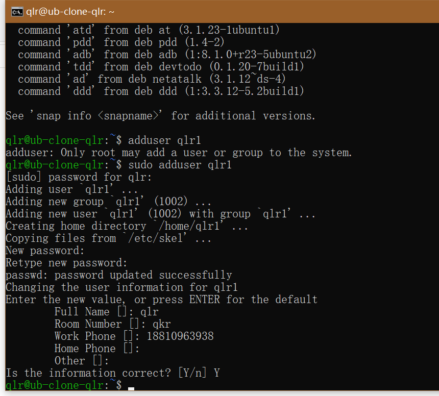
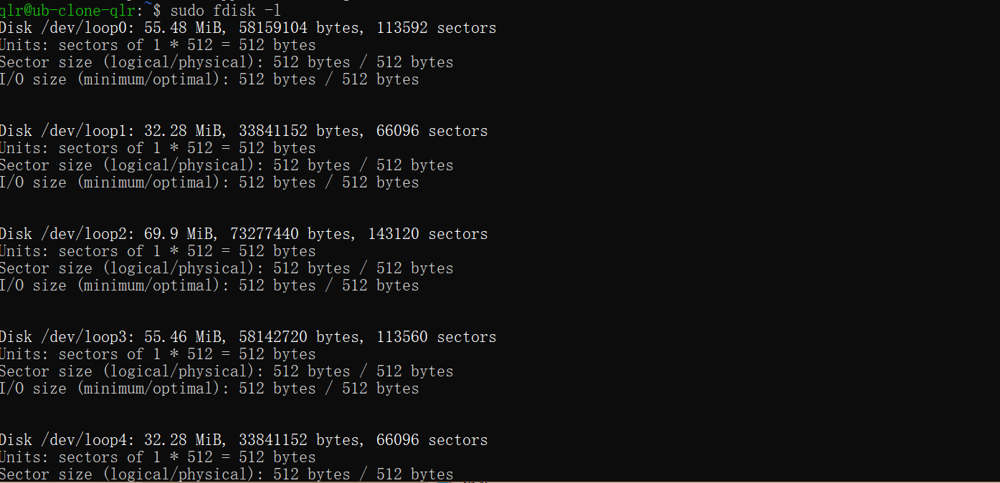
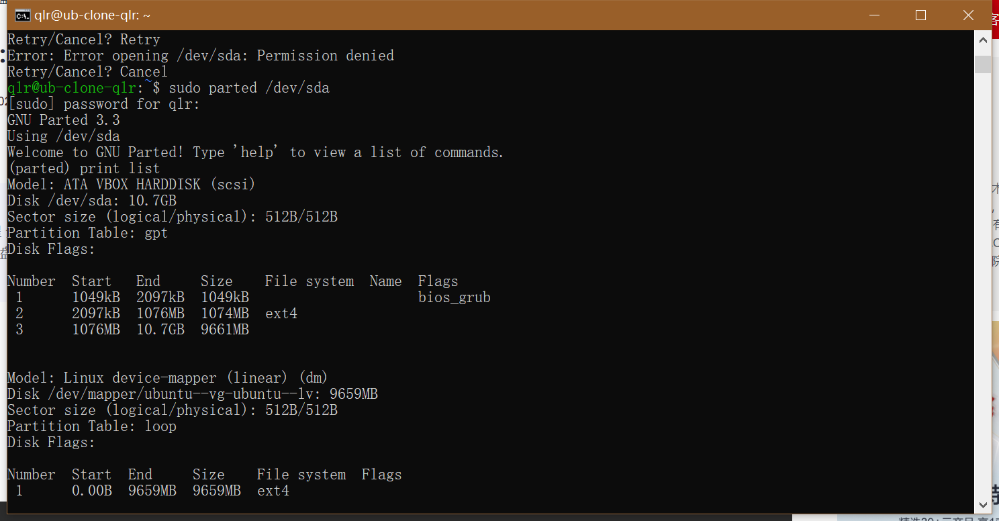
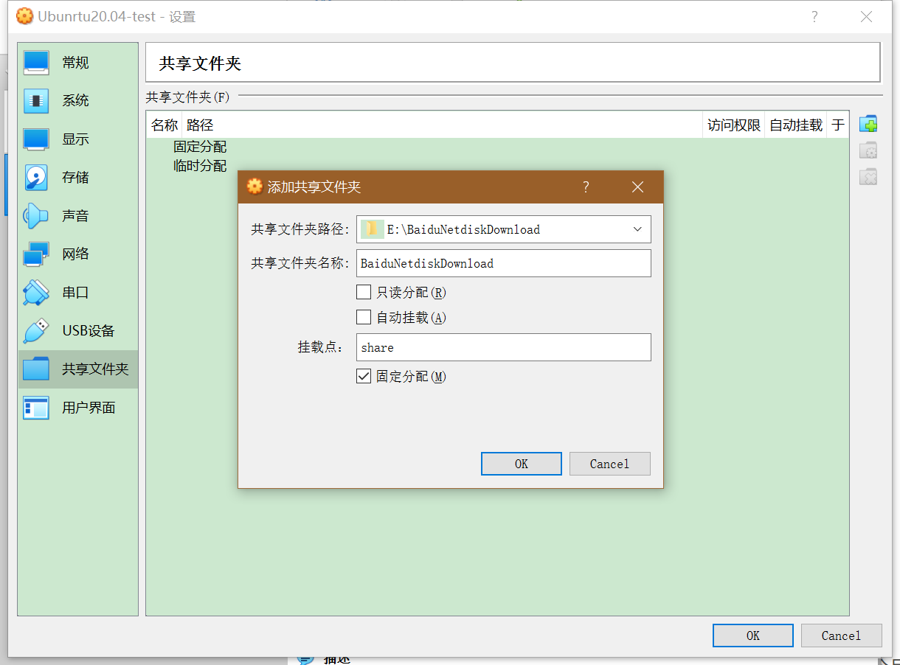

# Linux第三章实验报告

## 实验环境
- ubuntu 20.04.2 LTS as the guest OS
- vscode remote-ssh
- Oracle VM VirtualBox version 6.1.18 with Extension Pack installed

## 实验要求
- 阅读阮一峰的「Systemd 入门教程：命令篇」与「Systemd 入门教程：实战篇」并进行动手实操。录屏上传到asciinema
- 完成课后自查清单

## systemd入门篇操作录屏

[1-3节系统管理](https://asciinema.org/a/406513)

[4-5节Unit及其配置文件](https://asciinema.org/a/406516)

[6-7节Target与日志管理](https://asciinema.org/a/406518)
（第七节实时滚动显示最新日志的操作不知道咋退出就没做，做了就没法录屏了QAQ）

## systemd实战篇操作录屏

[全过程录屏](https://asciinema.org/a/406521)

## 自查清单

### 1.如何添加一个用户并使其具备sudo执行程序的权限？
1. 添加新用户 `adduser username`
2.使用 `sudo usermod -G username sudo -a username`为其授予sudo权限

### 2.如何将一个用户添加到一个用户组
不能使用`usermod -G group1`这样会使用户离开原先所在的用户组，应使用`usermod -a -G group1 user`命令

### 3.如何查看当前系统的分区表和文件系统详细信息？
1. `fdisk -l`可以列出硬盘的分区表、文件大小与分区类型

2. `sudo parted /dev/sda`命令可以查看各分区的系统文件类型


### 4.如何实现开机自动挂载Virtualbox的共享目录分区？
1. 在virtualbox中点击设备->共享文件夹，在里面设置共享文件夹

2. 在Ubuntu的/mnt目录下新建一个名为“share”的文件夹
```
cd /mnt/
sudo mkdir share
```
3. 在虚拟机里修改/etc/fstab文件
`vim /etc/fstab`打开文件
在其中加入`share /mnt/share vboxsf rw,auto 0 0`语句，保存并退出
（需要提前使用chmod将该文件修改为可写，不然没法修改）
4.重启ubuntu，ubuntu便会自动将所选定的所有目录自动挂载到指定的地址下

### 5.基于LVM（逻辑分卷管理）的分区如何实现动态扩容和缩减容量？
1.制作VG
`pvcreate  /dev/vdb1`

2.制作VG（卷组）
`vgcreate  vg1 /dev/vdb1`

3.制作LV（逻辑卷）
`lvcreate   -n  lv1  -L  3G vg1`

4.格式化
`mkfs.ext4 /dev/vg1/lv1`

5.挂载
`mount  /dev/vg1/lv1   /opt/`

#### 动态扩容
逻辑卷扩展：
`lvextend   -L   +300M /dev/vg1/lv1`

扩展文件系统
`resize2fs   /dev/vg1/lv1` 
#### 缩减
1、先卸载`umount   /opt/` ,卸载不影响里面的资料

2、检查文件系统是否正常工作
`e2fsck -f   /dev/vg1/lv1` 
3.删除逻辑卷卷组
```
lvremove /dev/vg1/lv1
vgremove /dev/vg1
```
### 6.如何通过systemd设置实现在网络连通时运行一个指定脚本，在网络断开时运行另一个脚本？
1. 修改__systemd-networkd.service__配置文件
```
[Service]
...
ExecStart =<path_service1> start
ExecStart =<path_service2> stop
...
```
### 7.如何通过systemd设置实现一个脚本在任何情况下被杀死之后会立即重新启动？实现杀不死？
服务脚本配置
```
[Service]
...
Restart = Always
...
```