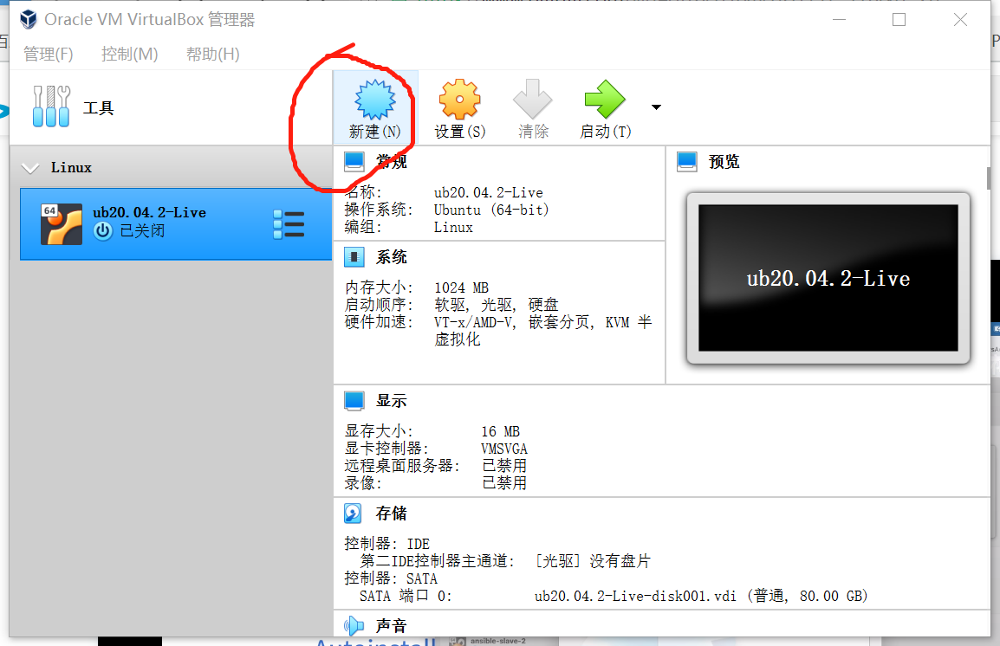
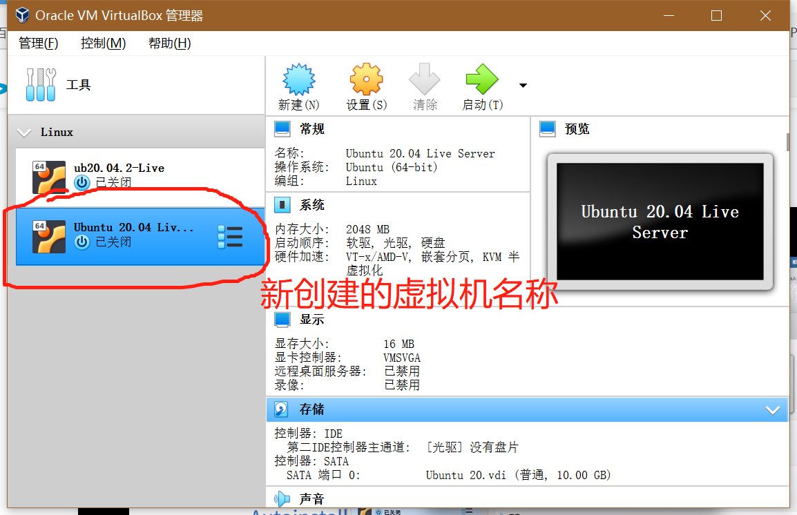

# 无人值守安装Ubuntu

## 实验流程
1. 手动安装Ubuntu后得到"自动配置描述文件"
在Ubuntu官网下载镜像文件

创建新的系统



选择镜像盘


网卡设置

有人值守安装


2. 从虚拟机处下载autoinstall-user-data并修改参数，删除手工安装的序列号：

```
#cloud-config
autoinstall:
  apt:
    geoip: true
    preserve_sources_list: false
    primary:
    - arches: [amd64, i386]
      uri: http://cn.archive.ubuntu.com/ubuntu
    - arches: [default]
      uri: http://ports.ubuntu.com/ubuntu-ports
  identity: {hostname: ub-clone-qlr, password: $6$aISJh0qHySwOs.tt$iwPngqVPIhcHzfyuFNuOQU8UnMXZNZ2N8FIGE27WKjhNfSUH3b2kCv7MHYzBiHRvuzX3yNiiuR8F6GMfsOL900,
    realname: qlr, username: qlr}
  keyboard: {layout: us, toggle: null, variant: ''}
  timezone: Asia/Shanghai #添加时区
  locale: en_US.UTF-8
  network:
    ethernets:
      enp0s3: {dhcp4: true}
      enp0s8: {dhcp4: true}
    version: 2
  ssh:
    allow-pw: true
    authorized-keys: []
    install-server: true
  storage:
    config:
    - {ptable: gpt, path: /dev/sda, wipe: superblock,
      preserve: false, name: '', grub_device: true, type: disk, id: disk-sda}
    - {device: disk-sda, size: 1MB, flag: bios_grub, number: 1, preserve: false,
      grub_device: false, type: partition, id: partition-0}
    - {device: disk-sda, size: 1GB, wipe: superblock, flag: '', number: 2,
      preserve: false, grub_device: false, type: partition, id: partition-1}
    - {fstype: ext4, volume: partition-1, preserve: false, type: format, id: format-0}
    - {device: disk-sda, size: -1, wipe: superblock, flag: '', number: 3,
      preserve: false, grub_device: false, type: partition, id: partition-2}
    - name: ubuntu-vg
      devices: [partition-2]
      preserve: false
      type: lvm_volgroup
      id: lvm_volgroup-0
    - {name: ubuntu-lv, volgroup: lvm_volgroup-0, size: 9659482112B, preserve: false,
      type: lvm_partition, id: lvm_partition-0}
    - {fstype: ext4, volume: lvm_partition-0, preserve: false, type: format, id: format-1}
    - {device: format-1, path: /, type: mount, id: mount-1}
    - {device: format-0, path: /boot, type: mount, id: mount-0}
  version: 1

```
3. 新建可用于安装64位Ubuntu系统的虚拟机配置

4. 于SATA下按序挂载镜像安装文件与focal-init.iso

5. 启动虚拟机，待出现"Continue with autoinstall? (yes|no)"时输入"yes"开始进行无人值守安装。
